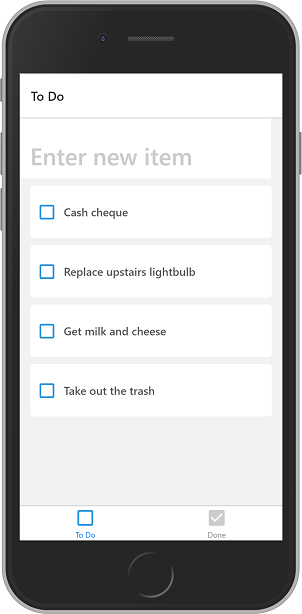
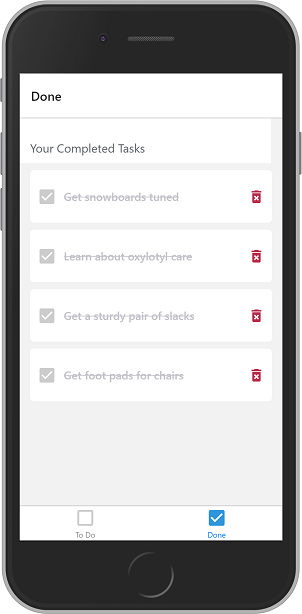

# To Do List

Mobile app for basic management of a To Do list.

Quickly add tasks to a To Do list or mark tasks as complete. View or delete completed tasks in a separate screen.

[](./screenshots/react-native-todo-screen1.png)
[](./screenshots/react-native-todo-screen2.png)

React Native app built with Expo. Tested on Web and Android. Only uses AsyncStorage/localStorage for now. Adapted from [tutorial](https://pusher.com/tutorials/build-to-do-app-react-native-expo) with changes to the UI.

## Setup

```bash
npm install
npm install expo -g
expo start
```
